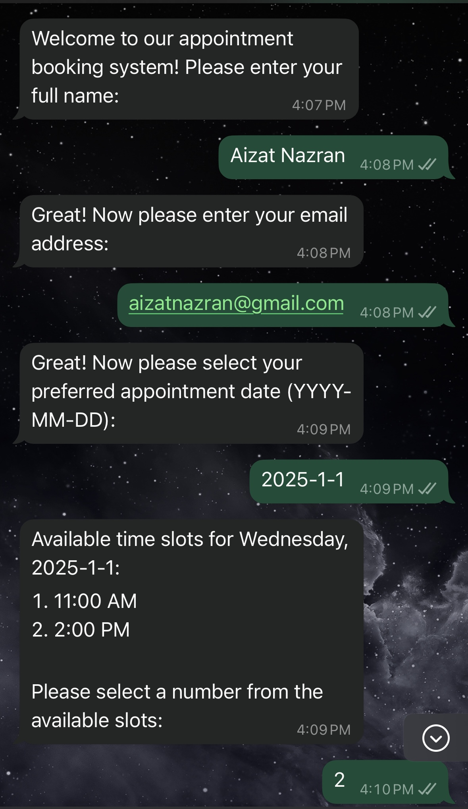

# WhatsApp Appointment Chatbot

A WhatsApp chatbot application built with Laravel, Next.js, and MySQL for booking appointments and collecting user information.



## Prerequisites

- PHP 8.1 or higher
- Composer
- Node.js and npm
- MySQL
- WhatsApp Business API credentials

## Project Structure

```
whatsapp-chatbot/
├── backend/           # Laravel backend application
└── frontend/         # Next.js frontend application
```

## Setup Instructions

### Backend Setup

1. Navigate to the backend directory:
   ```bash
   cd backend
   ```

2. Install PHP dependencies:
   ```bash
   composer install
   ```

3. Copy .env.example to .env and configure:
   ```bash
   cp .env.example .env
   ```

4. Configure your .env file with:
   - Database credentials
   - WhatsApp API credentials
   - App URL and other settings

5. Generate application key:
   ```bash
   php artisan key:generate
   ```

6. Run migrations:
   ```bash
   php artisan migrate
   ```

### Frontend Setup

1. Navigate to the frontend directory:
   ```bash
   cd frontend
   ```

2. Install dependencies:
   ```bash
   npm install
   ```

3. Copy .env.example to .env.local and configure:
   ```bash
   cp .env.example .env
   ```

## Database Setup and Management

To set up and manage the database, follow these steps:

1. First, ensure your database configuration is correct in `backend/.env`:
   ```env
   DB_CONNECTION=mysql
   DB_HOST=127.0.0.1
   DB_PORT=3306
   DB_DATABASE=your_database_name
   DB_USERNAME=your_username
   DB_PASSWORD=your_password
   ```

2. Reset and set up the database (this will delete all existing data):
   ```bash
   cd backend
   php artisan migrate:fresh   
   php artisan db:seed        
   ```

3. Other useful database commands:
   ```bash
   # View migration status
   php artisan migrate:status

   # Roll back all migrations
   php artisan migrate:reset

   # Roll back and re-run migrations
   php artisan migrate:refresh

   # Only run seeders
   php artisan db:seed
   ```

## Running the Application

### Backend
```bash
cd backend
php artisan serve
```

### Frontend
```bash
cd frontend
npm run dev
```

## Features

- WhatsApp chatbot integration
- User information collection (name, email, phone)
- Appointment booking system
- Admin dashboard for appointment management
- Real-time updates

## Database Schema

The application uses MySQL with the following main tables:
- users: Stores user information
- appointments: Stores appointment details
- chat_sessions: Tracks ongoing chat sessions

## Testing

Run backend tests:
```bash
cd backend
php artisan test
```

Run frontend tests:
```bash
cd frontend
npm run test
```
